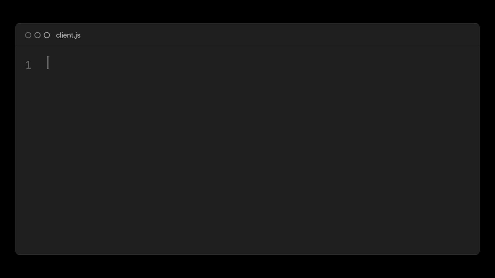
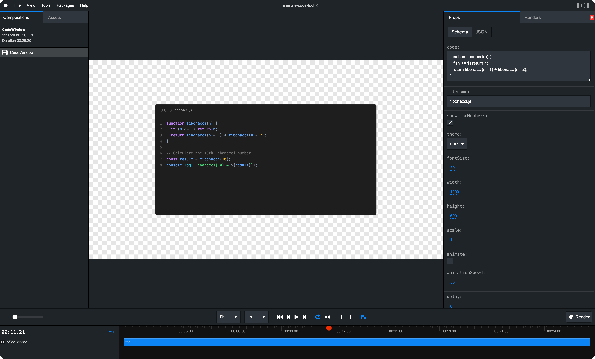

# DevRel Video Assets

Create beautiful, animated code windows for your videos using [Remotion](https://remotion.dev). Generate macOS-style code windows with typewriter animations, syntax highlighting, and customizable themes.



_developed with ❤️ @ [Sentry](https://github.com/getsentry)_

## 🚀 Features

- **Typewriter Animation**: Smooth character-by-character typing with intelligent word bursting
- **Multiple Themes**: 9 built-in themes (Dark, Light, GitHub, GitHub Dark, Vercel, Nord, Dracula, Monokai, Sentry)
- **Syntax Highlighting**: Powered by [sugar-high](https://github.com/huozhi/sugar-high)
- **macOS-style Window**: Beautiful window chrome with colored dots
- **Line Numbers**: Optional line numbering
- **Customizable**: Control size, font, colors, animation speed, and more
- **Transparent Background Support**: Export with alpha channel for video editing



## 📦 Installation

```bash
# Clone the repository
git clone <your-repo-url>
cd animate-code-tool

# Install dependencies (using pnpm)
pnpm install

# Start the Remotion Studio
pnpm dev
```

## 🎬 Quick Start

1. **Start the development server**:
   ```bash
   pnpm dev
   ```

2. **Open Remotion Studio** in your browser (usually at `http://localhost:3000`)

3. **Customize your code window** using the interactive props editor in the right sidebar

4. **Preview in real-time** and adjust settings until you're happy

5. **Render your video** using the render button or CLI

## 🎨 Props Reference

The `CodeWindowScene` component accepts the following props:

### Content Props

| Prop | Type | Default | Description |
|------|------|---------|-------------|
| `code` | `string` | Sample code | The code to display and animate |
| `filename` | `string` | `"fibonacci.js"` | Filename shown in the window header |

### Visual Props

| Prop | Type | Default | Description |
|------|------|---------|-------------|
| `theme` | `string` | `"dark"` | Color theme (see Themes section) |
| `fontSize` | `number` | `20` | Font size in pixels (8-72) |
| `showLineNumbers` | `boolean` | `true` | Show/hide line numbers |
| `showCursor` | `boolean` | `true` | Show/hide blinking cursor during animation |
| `width` | `number` | `1200` | Window width in pixels (200-2000) |
| `height` | `number` | `600` | Window height in pixels (100-2000) |
| `scale` | `number` | `1.0` | Scale factor for the entire window (0.1-3.0) |

### Animation Props

| Prop | Type | Default | Description |
|------|------|---------|-------------|
| `animate` | `boolean` | `false` | Enable typewriter animation |
| `animationSpeed` | `number` | `15` | Animation speed (1-100, higher = faster) |
| `delay` | `number` | `0` | Delay in frames before animation starts (0-300) |
| `durationInFrames` | `number` | `800` | Total video duration in frames |

### Animation Speed Guide

The `animationSpeed` prop controls how fast the typewriter effect types:
- **1-20**: Slow, deliberate typing (good for tutorials)
- **20-50**: Medium speed (good for demonstrations)
- **50-100**: Fast typing (good for quick showcases)

> **Note**: The animation uses intelligent word bursting - it types faster in the middle of words and slows down at spaces for a more natural feel.

## 🎨 Available Themes

Choose from 9 professionally designed themes:

- `dark` - Clean dark theme with subtle colors
- `light` - Bright light theme
- `github` - GitHub's light theme
- `githubDark` - GitHub's dark theme
- `vercel` - Vercel's signature black theme with cyan/magenta accents
- `nord` - Popular Nord color palette
- `dracula` - The famous Dracula theme
- `monokai` - Classic Monokai theme
- `sentry` - Sentry's purple theme

## 📹 Rendering

### Render from Studio

1. Open Remotion Studio (`pnpm dev`)
2. Click the "Render" button in the top right
3. Select ProRes as the codec
4. Under ProRes profile, select 4444
5. Click "Picture" and change the Image Format to PNG
6. Change "Pixel Format" to "yuva444p10le"
7. Click "Render"


### Render from CLI

```bash
# Basic render
npx remotion render CodeWindow out/MyCodeWindow.mp4

# Render with custom props
npx remotion render CodeWindow out/MyCodeWindow.mp4 --props='{"code":"console.log(\"Hello\");","filename":"hello.js","animate":true}'

# Render at higher quality
npx remotion render CodeWindow out/MyCodeWindow.mp4 --quality=100
```

### 🎯 Rendering with Transparent Background (ProRes)

**Important**: Since Remotion v2.1.7, you can render with alpha channel support for transparent backgrounds. This is perfect for overlaying code windows on other video content.

To render with transparency, you **must** use the ProRes codec with an alpha-supporting profile:

```bash
npx remotion render CodeWindow out/MyCodeWindow.mov \
  --codec=prores \
  --prores-profile=4444 \
  --pixel-format=yuva444p10le
```

#### ProRes Profile Options with Alpha:

- `4444` - ProRes 4444 (highest quality with alpha)
- `hq` - ProRes HQ (high quality with alpha)

#### Required Settings:

- **Codec**: `prores`
- **ProRes Profile**: `4444` or `hq`
- **Pixel Format**: `yuva444p10le`

> **Note**: ProRes files are larger than H.264/H.265 but preserve transparency and offer better quality for video editing workflows. The `.mov` extension is recommended for ProRes output.

## 🛠️ Customization

### Creating Custom Themes

Edit `src/themes/index.ts` to add your own themes:

```typescript
export const themes: Record<string, CodeTheme> = {
  myTheme: {
    name: "My Custom Theme",
    background: "#1a1a1a",
    border: "#333333",
    headerBg: "#1a1a1a",
    headerText: "#ffffff",
    codeBg: "#1a1a1a",
    codeText: "#e0e0e0",
    lineNumbers: "rgba(255, 255, 255, 0.3)",
    dots: {
      red: "#ff5f57",
      yellow: "#febc2e",
      green: "#28c840",
    },
    syntax: {
      keyword: "#ff6b9d",
      string: "#c3e88d",
      number: "#f78c6c",
      comment: "#546e7a",
      function: "#82aaff",
      class: "#ffcb6b",
      property: "#89ddff",
      operator: "#89ddff",
    },
  },
  // ... other themes
};
```

## 📖 Additional Resources

- [Remotion Documentation](https://remotion.dev/docs)
- [Remotion CLI Reference](https://remotion.dev/docs/cli)
- [ProRes Codec Documentation](https://remotion.dev/docs/config#setcodec)

## 🤝 Contributing

Contributions are welcome! Feel free to:
- Add new themes
- Improve animation algorithms
- Add new features
- Fix bugs

---

Built with [Remotion](https://remotion.dev) 🎬

